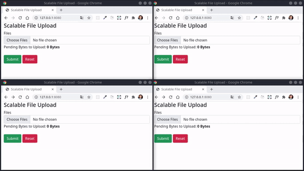

# Scalable File Upload

![BADGE_NODE_VERSION]
![BADGE_LICENSE]
![BADGE_ISSUES_OPEN]
![BADGE_ISSUES_CLOSED]
![BADGE_OPEN_PULL_REQUESTS]
![BADGE_STARS]
![BADGE_FORKS]

> Simple project to upload files in a scalable way and work with JavaScript streams and socket.

## 🎦 **Preview**



## 📝 **Requirements**

- NodeJS v15+

## 💻 **Techs**

- [http-server](https://www.npmjs.com/package/http-server)
- [bootstrap](https://getbootstrap.com/)
- [nodemon](https://www.npmjs.com/package/nodemon)
- [socket.io](https://socket.io/)
- [pino](https://github.com/pinojs/pino)
- [busboy](https://github.com/mscdex/busboy)

## 🍷 **Using**

Install all dependencies contained in the client and server directories:

```bash
$ cd packages/client/
$ npm ci
$ cd packages/server
$ npm ci
```

Now, open two terminal windows and run the client and the server:

```bash
# Terminal 01
$ cd packages/client/
$ npm start

# Terminal 02
$ cd packages/server
$ npm start
```


## 📖 **References**

  - Erick Wendel Channel: [Part 01](https://www.youtube.com/watch?v=OG_qqYzcfFk&t=11s) | [Part 02](https://www.youtube.com/watch?v=QRhoGbnEs78)
  - NodeJS Core Documentation: [http](https://nodejs.org/api/http.html) | [url](https://nodejs.org/api/url.html) | [path](https://nodejs.org/api/path.html) | [fs](https://nodejs.org/api/fs.html) | [stream](https://nodejs.org/api/stream.html)

## 🧾 **License**

**Scalable File Upload** is available under the [MIT license](https://opensource.org/licenses/MIT). See [LICENSE](./LICENSE) for the full license text.


<!-- Badges -->

[BADGE_NODE_VERSION]: https://img.shields.io/badge/nodejs->=v15.5.0-3c873a
[BADGE_LICENSE]: https://img.shields.io/github/license/x0n4d0/scalable-file-upload
[BADGE_ISSUES_OPEN]: https://img.shields.io/github/issues/x0n4d0/scalable-file-upload
[BADGE_ISSUES_CLOSED]: https://img.shields.io/github/issues-closed/x0n4d0/scalable-file-upload?color=red
[BADGE_OPEN_PULL_REQUESTS]: https://img.shields.io/github/issues-pr/x0n4d0/scalable-file-upload?color=blue
[BADGE_STARS]: https://img.shields.io/github/stars/x0n4d0/scalable-file-upload?color=inactive
[BADGE_FORKS]: https://img.shields.io/github/forks/x0n4d0/scalable-file-upload?color=inactive
